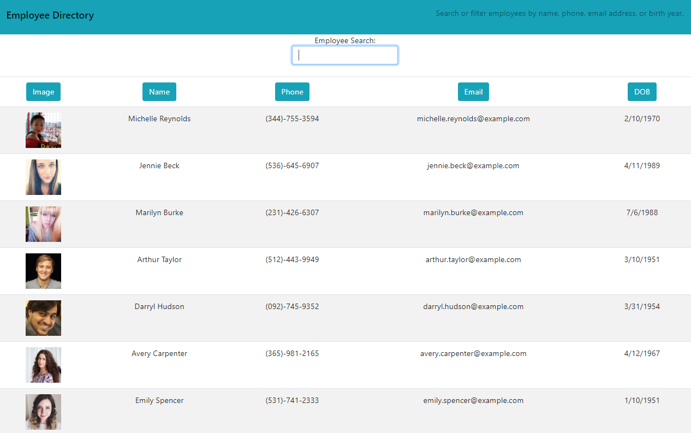
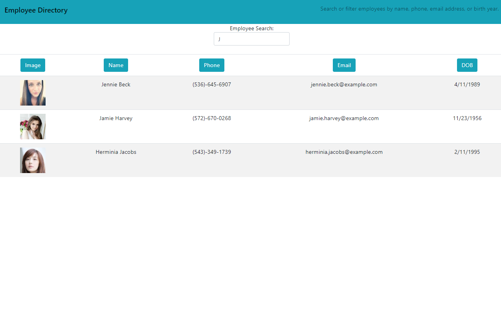

# React-Employee-Manager
#### Table of Contents
  * [Description](#Description)
  * [Installation](#Installation)
  * [Screenshots](#Screenshots)
  * [Credits](#Credits)
  * [License](#License)

## Description
Construcuted with React, this application pulls in employee data from an API and maps each user to a row. Employees can be filtered by typing any portion of their name, phone, email, or birth year. Sorting A-Z, Z-A, 0-9, or 9-0 can be performed on Name, Email, Phone, and DOB. Image is not a sortable item.

Click [Here](https://whackingmufn.github.io/react-employee-directory) to view the GitHub Pages deployment.
 
## Installation
#### Technologies Used
* HTML/CSS/JavaScript
* [React](https://reactjs.org/)
* [Node](https://nodejs.org/en/) and [npm](https://www.npmjs.com/package/npm)
* [Visual Studio Code](https://code.visualstudio.com/)
* [cmder](https://cmder.net/)

#### Steps
1. * Start by entering the following in your terminal: `Git clone https://github.com/whackingMUFN/react-employee-directory.git`

2. * Change directory to `react-employee-directory` and enter `npm install` into your terminal. This will install all package dependencies.

3. * Add node_modules to .gitignore.

4. * Start the application by running `npm start`

## Screenshot
#### Main

#### Filtered
 

## Credits
This assignment was provided by Trilogy Education Services. The application was created based on in class activities and lectures, [MDN](https://developer.mozilla.org/en-US/) Reference Documents for JavaScript syntax, [React Docs](https://reactjs.org/docs/getting-started.html) for JSX syntax and basic setup, and various other online resources.

## License

[License](LICENSE)
MIT &copy; 2020 Calvin Freese
